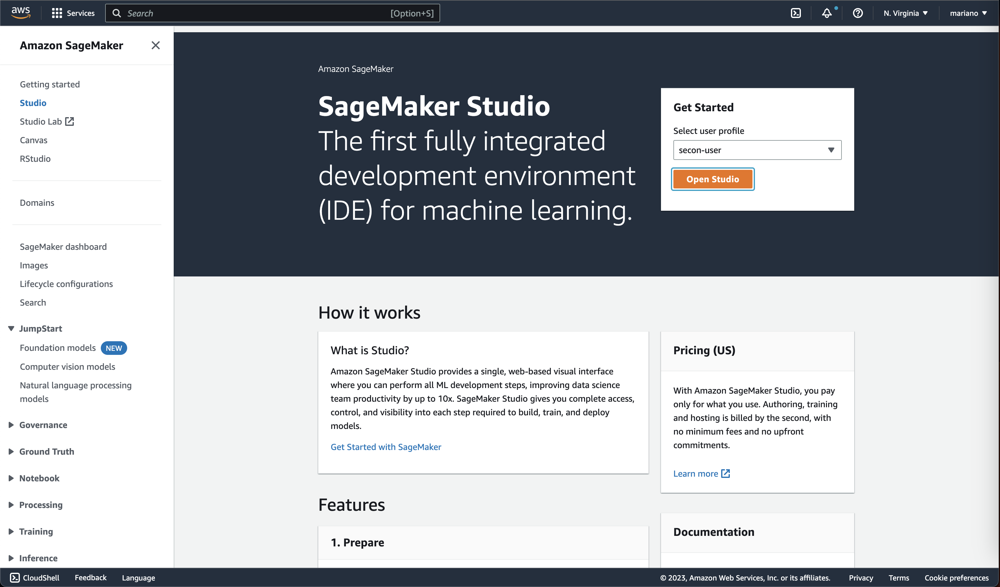
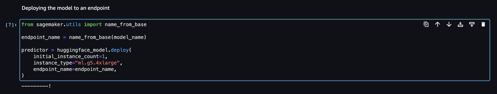
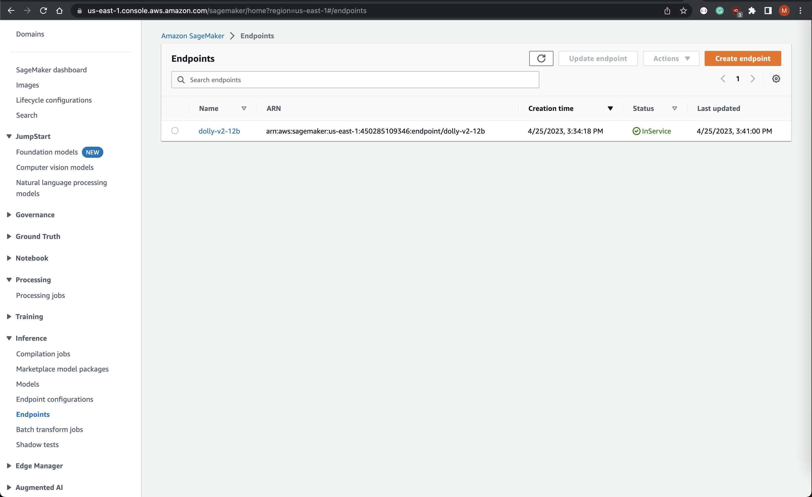
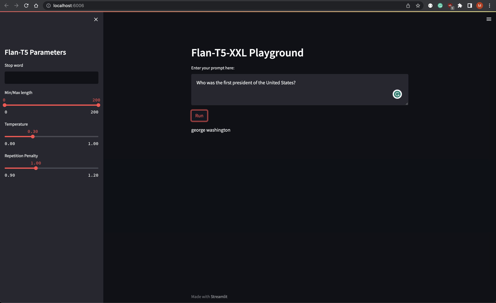

# Introduction to MLOps with AWS SageMaker, running your first LLM - SECON 2023

## Getting Started

### Prerequisites - Runtimes

Install the following binaries on your machine:

```bash
brew install awscli
brew install go-task
brew install terraform
```

### Prerequisites - AWS Resources

Make sure your have an AWS account configured:

```bash
cat ~/.aws/config

aws_access_key_id = [REDACTED]
aws_secret_access_key = [REDACTED]
```

1. Clone the repo
    ```bash
    git clone https://github.com/eschizoid/secon-2023.git
    ```
2. Run Terraform init to check the provider loaded as expected
   ```bash
   task tf_init
   ```
3. Run Terraform Plan
   ```bash
   task tf_plan
   ```
4. Create SageMaker domain, user profile, and JupyterServer
   ```bash
   task tf_apply
   ```
5. Upload model to S3
   ```bash
   task tar_model
   task upload_model
   ```

## Provisioning JupyterServer

Once the infrastructure is up and running, you can access the JupyterServer by clicking the button "Open Studio" in the
SageMaker console:



## Deploying LLM - Flan T5 XXL

From the JupyterServer, you can import this git repo and reference the notebook `notebooks/deploy-to-sm-endpoint.ipynb`.

After importing the notebook into the JupyterServer, you can proceed to deeploy the model like the image below shows:

--- 
**NOTE**

It's important to mention that this step might take a couple of minutes to complete.

---



You can verify the model was deployed successfully by checking the SageMaker endpoint status on the AWS Console:



## Consuming SageMaker Endpoint

Inspired by the documentation on how to
use [TensorBoard in SM Studio](https://docs.aws.amazon.com/sagemaker/latest/dg/studio-tensorboard.html), we can use the
same mechanism to spin up a [Streamlit](https://streamlit.io) application.

To do so, just execute the following command:

```bash
task run_playground
```



You will be able to access the playground on: `https://localhost/8501/`
