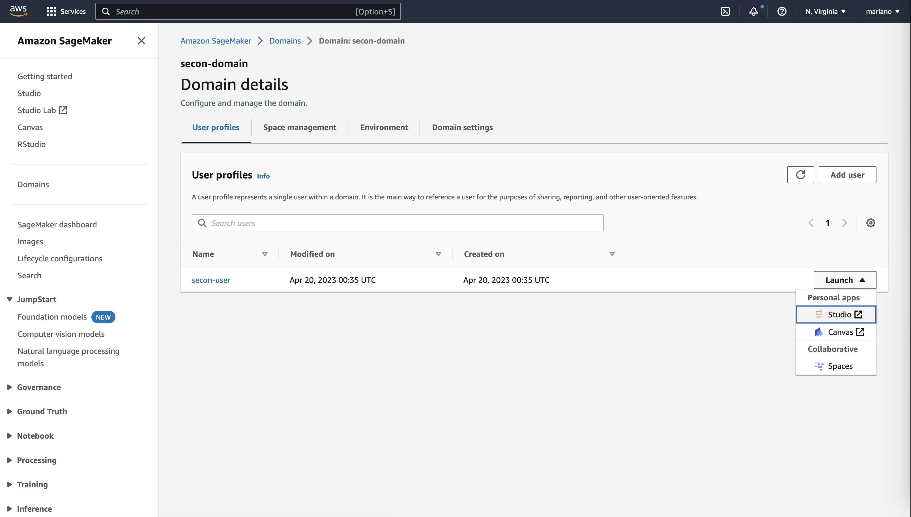
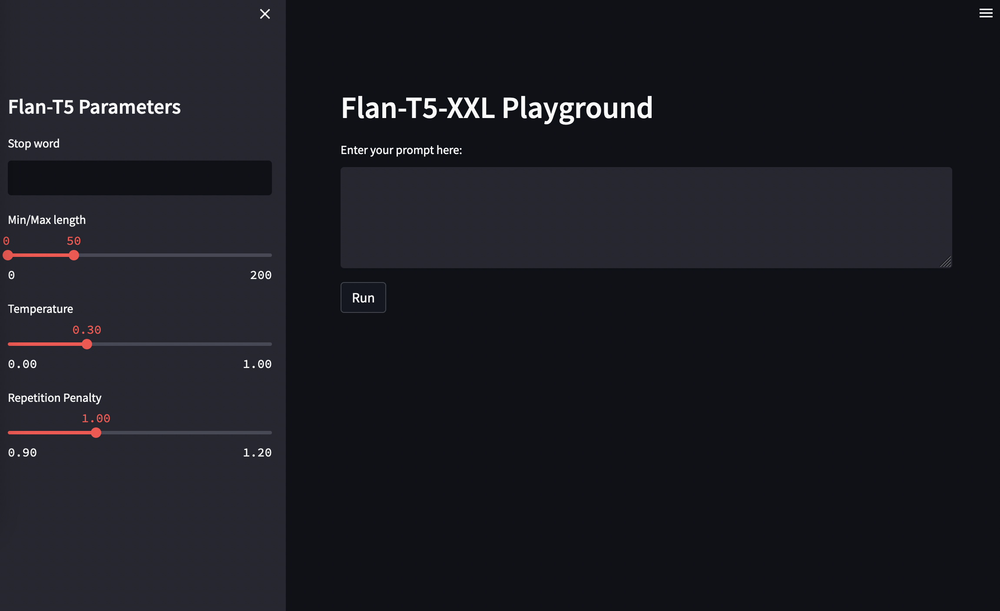

# Introduction to MLOps with AWS SageMaker, running your first LLM - SECON 2023

## Getting Started

### Prerequisites - Runtimes

Install the following binaries on your machine:

```bash
brew install awscli
brew install go-task
brew install terraform
```

### Prerequisites - AWS Resources

Make sure your have an AWS account configured:

```bash
cat ~/.aws/config

aws_access_key_id = [REDACTED]
aws_secret_access_key = [REDACTED]
```

1. Clone the repo
    ```bash
    git clone https://github.com/eschizoid/secon-2023.git
    ```
2. Run Terraform init to check the provider loaded as expected
   ```bash
   task tf_init
   ```
3. Run Terraform Plan
   ```bash
   task tf_plan
   ```
4. Run Terraform apply
   ```bash
   task tf_apply
   ```
5. Create Sagemaker domain, user profile and notebook instance
   ```bash
    task sm_create_studio
    ```
6. Upload model to S3
   ```bash
    task tar_model
    task upload_model
    ```

## Launching Jupyter Lab

Once the infrastructure is up and running, you can access the Jupyter Lab by using the SageMaker console like the image
belows shows:



## Deploy LLM - Flan T5 XXL

Once we are in Jupyter Lab we can follow the steps outlined in the notebook `deploy-to-sm-endpoint.ipynb`.

## Consuming SageMaker Endpoint



Inspired by the documentation on how to
use [TensorBoard in SM Studio](https://docs.aws.amazon.com/sagemaker/latest/dg/studio-tensorboard.html), we can use the
same mechanism to spin up a [Streamlit](https://streamlit.io) app in SM Studio.

To do so, just execute the following command:

```bash
task run_playground
```

You will be able to access the playground
on `https://<YOUR_STUDIO_ID>.studio.<YOUR_REGION>.sagemaker.aws/jupyter/default/proxy/6006/`.
