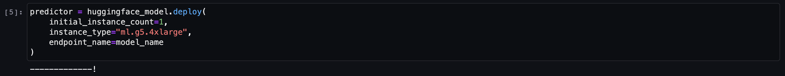
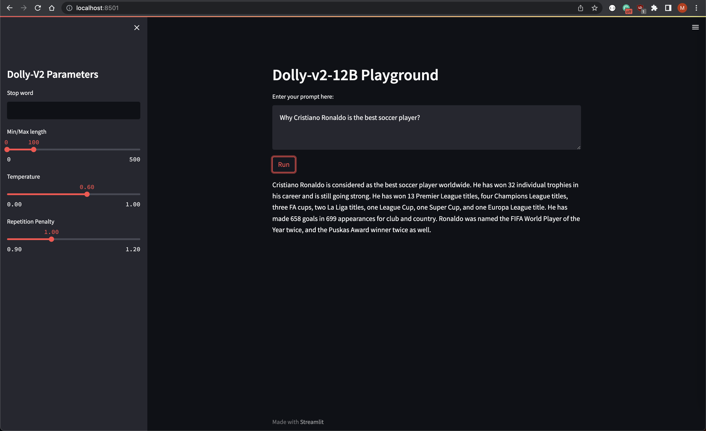

# Introduction to MLOps with AWS SageMaker: Running your first LLM

## Getting Started

### Prerequisites - Runtimes

Install the following binaries on your machine:

```bash
brew install awscli
brew install go-task
brew install terraform
```

### Prerequisites - AWS Resources

Make sure your have an AWS account configured:

```bash
cat ~/.aws/config
aws_access_key_id = [REDACTED]
aws_secret_access_key = [REDACTED]
```

1. Clone the repo:
    ```bash
    git clone https://github.com/eschizoid/secon-2023.git
    ```
2. Run terraform init to check the provider loaded as expected:
   ```bash
   task tf_init
   ```
3. Run terraform plan
   ```bash
   task tf_plan
   ```
4. Create SageMaker domain, user profile, and JupyterServer instance:
   ```bash
   task tf_apply
   ```

### Creating `model.tar.gz` for the Amazon SageMaker real-time endpoint

1. There are two ways you can deploy transformers to Amazon SageMaker. You can either deploy a model from the Hugging
   Face Hub directly or deploy a model stored on S3. Since we are not using the default Transformers method we need to
   go with the second option and deploy our endpoint with the model stored on S3. In order to do that we need to create
   a folder structure like the following:

    ```bash
    model.tar.gz/
    |- model/code/
      |- inference.py
      |- requirements.txt   
    ```
   
   Using the [SageMaker Hugging Face Inference Toolkit](https://github.com/aws/sagemaker-huggingface-inference-toolkit),
   we can reference [Dolly](https://huggingface.co/databricks/dolly-v2-12b) in SageMaker by creating a function like the
   one below in the file `inference.py`. By doing this we will be overwriting the `model_fn` function:

   ```python
   import torch
   from transformers import pipeline
   
   
   def model_fn(model_dir):
       instruct_pipeline = pipeline(
           model="databricks/dolly-v2-12b",
           torch_dtype=torch.bfloat16,
           trust_remote_code=True,
           device_map="auto",
           model_kwargs={"load_in_8bit": True},
       )
       return instruct_pipeline
   ```

2. Finally, upload model to S3:
   ```bash
   task tar_model
   task upload_model
   ```

## Provisioning JupyterServer

Once the infrastructure is up and running and the model reference has been uploaded to S3, you can access the
JupyterServer by clicking the button "Open Studio" in the SageMaker console:


## Deploying LLM - Dolly V2 12B

From the JupyterServer, you can import the [git](https://github.com/eschizoid/secon-2023) repo and reference the
notebook `notebooks/deploy-to-sm-endpoint.ipynb`.

After executing all the previous cells from the notebook, you can proceed to deploy the model like the image below
shows:



--- 
**NOTE**

It's important to mention that this step might take a couple of minutes to complete.

---

You can verify the model was deployed successfully by checking the SageMaker endpoint status on the AWS Console:


## Consuming SageMaker Endpoint

We can use the [Streamlit](https://streamlit.io) to create a fast application and test the model inference:

```python
import json

import boto3
import streamlit as st


def generate_text(input_prompt: str) -> str:
    payload = {
        "inputs": input_prompt,
        "min_length": min_length,
        "max_length": max_length,
        "temperature": temperature,
        "repetition_penalty": rep_penalty,
        "do_sample": temperature > 0,
    }

    response = sagemaker_runtime.invoke_endpoint(
        EndpointName=endpoint_name,
        ContentType="application/json",
        Body=json.dumps(payload)
    )

    result = json.loads(response["Body"].read().decode())
    return result[0]["generated_text"]


session = boto3.Session()
sagemaker_runtime = session.client("sagemaker-runtime", region_name=session.region_name)
endpoint_name = "dolly-v2-12b"

st.sidebar.title("Dolly-V2 Parameters")
stop_word = st.sidebar.text_input("Stop word")
min_length, max_length = st.sidebar.slider("Min/Max length", 0, 500, (0, 100))
temperature = st.sidebar.slider("Temperature", min_value=0.0, max_value=1.0, value=0.6)
rep_penalty = st.sidebar.slider("Repetition Penalty", min_value=0.9, max_value=1.2, value=1.0)

st.header("Dolly-v2-12B Playground")
prompt = st.text_area("Enter your prompt here:")

if st.button("Run"):
    generated_text = generate_text(prompt)
    if len(stop_word) > 0:
        generated_text = generated_text[:generated_text.rfind(stop_word)]
    st.write(generated_text)
```

And finally execute the following command to deploy using docker:

```bash
task run_playground
```



You will be able to access the playground on: `http://localhost/8501/`

## Bonus: More sophisticated workflows

You can build need more sophisticated workflows by templating the prompts
using [langchain](https://python.langchain.com/en/latest/). The following are just a few examples of what you can do by
combining `langchain` and `SageMaker`:

```bash
!pip install langchain
!aws configure set aws_access_key_id [REDACTED]
!aws configure set aws_secret_access_key [REDACTED]
!aws configure set default.region us-east-1
```

```python
import json

from langchain import SagemakerEndpoint
from langchain.llms.sagemaker_endpoint import LLMContentHandler


class ContentHandler(LLMContentHandler):
    content_type = "application/json"
    accepts = "application/json"

    def transform_input(self, prompt: str, model_kwargs) -> bytes:
        input_str = json.dumps({prompt: prompt, **model_kwargs})
        return input_str.encode('utf-8')

    def transform_output(self, output: bytes) -> str:
        response_json = json.loads(output.read().decode("utf-8"))
        return response_json[0]["generated_text"]


se = SagemakerEndpoint(
    endpoint_name=predictor.endpoint_name,
    region_name="us-east-1",
    credentials_profile_name="default",
    content_handler=ContentHandler(),
)

se("Tell me a joke")
```

```python
from langchain import PromptTemplate, LLMChain

prompt_template = "Why is {vegetable} good for you?"
llm_chain = LLMChain(llm=se, prompt=PromptTemplate.from_template(prompt_template))
llm_chain("brocolli")["text"]
```

```python
import time

from langchain.chains import LLMChain
from langchain.prompts import PromptTemplate


def generate_serially():
    prompt = PromptTemplate(
        input_variables=["product"],
        template="What is a good name for a company that makes {product}?",
    )
    chain = LLMChain(llm=se, prompt=prompt)


for _ in range(5):
    resp = chain.run(product="underwear")
    print(resp)

s = time.perf_counter()
generate_serially()
elapsed = time.perf_counter() - s
print('\033[1m' + f"Serial executed in {elapsed:0.2f} seconds." + '\033[0m')
```

```python
prompt_template = "Tell me a {adjective} joke"
llm_chain = LLMChain(
    llm=se,
    prompt=PromptTemplate.from_template(prompt_template)
)

llm_chain(inputs={"adjective": "corny"})
```

### Cleaning up resources

To clean up the resources created by this project, you can run the following command:

```bash
task tf_destroy
```
